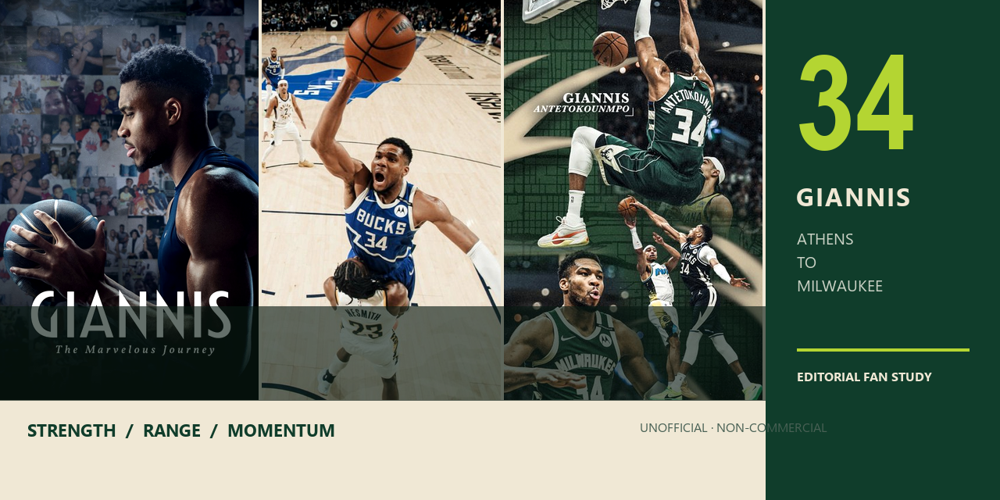

# Giannis Antetokounmpo — Editorial Fansite

A fan-made visual study of **sports editorial design, long-form storytelling, and responsive athlete presentation**.

**Live:** https://yns34-hub.github.io/giannis-fansite/  
**Status:** unofficial, non-commercial visual project

---

## Direction

The site uses a high-contrast sports-magazine language rather than a conventional profile page. Large typography, full-width imagery, statistics, milestones, highlights, and archive-style sections are combined into one continuous narrative.

## Sections

- **Hero** — full-screen identity and visual entry point
- **Origin Story** — narrative career introduction
- **Player Profile** — key physical and player information
- **Greek Freak DNA** — visual summary of style and athletic traits
- **Career Statistics** — selected performance data
- **Media** — highlights, timeline, and image-focused gallery
- **Trophy Room** — major honors and achievements
- **Wallpaper Archive** — curated fan gallery

## Visual system

- monochrome editorial base with restrained accent color
- large display type and poster-like compositions
- long-form vertical storytelling
- image-first section transitions
- responsive hierarchy across viewport sizes

## Stack

`HTML` · `CSS` · `JavaScript` · `GitHub Pages`

## Structure

```text
.
├── index.html        # main editorial experience
├── media.html        # highlights and gallery
├── script.js         # interaction layer
├── styles.css        # visual system
├── assets/           # imagery, awards, wallpapers, posters
└── docs/             # repository presentation assets
```

## Attribution

This is an **unofficial fan project** and is not affiliated with Giannis Antetokounmpo, the Milwaukee Bucks, or the NBA. Third-party names, imagery, statistics, and trademarks remain the property of their respective owners.
